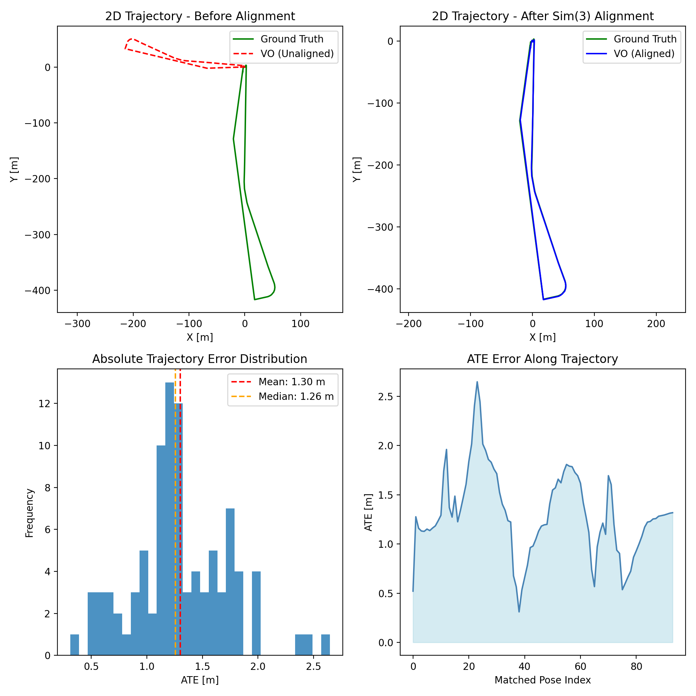

# AAE5303 Assignment: Visual Odometry with ORB-SLAM3

## Executive Summary

This report presents the implementation and evaluation of **Monocular Visual Odometry (VO)** using the **ORB-SLAM3** framework on the **HKisland_GNSS03** UAV aerial imagery dataset.

### Key Results

| Metric | Value | Description |
|--------|-------|-------------|
| **ATE RMSE** | **xxx m** | Global accuracy after Sim(3) alignment |
| **RPE Trans Drift** | **xx m/m** | Translation drift rate (delta=10 m) |
| **RPE Rot Drift** | **xx deg/100m** | Rotation drift rate (delta=10 m) |
| **Completeness** | **xx%** | Matched poses / total ground-truth poses |

---

## Introduction

ORB-SLAM3 is a state-of-the-art visual SLAM system capable of monocular, stereo, and visual-inertial odometry.

This assignment focuses on **Monocular VO mode**, which:
- Uses only camera images for pose estimation
- Cannot observe absolute scale (scale ambiguity)
- Relies on feature matching (ORB features) for tracking

---

## Methodology

### Evaluation Metrics

1. **ATE (Absolute Trajectory Error)**: Measures global trajectory accuracy after Sim(3) alignment
2. **RPE Translation Drift**: Local translation consistency (error per meter traveled)
3. **RPE Rotation Drift**: Local rotation consistency (error per 100 meters)
4. **Completeness**: Percentage of ground-truth poses successfully matched

---

## Dataset Description

### HKisland_GNSS03 Dataset

| Property | Value |
|----------|-------|
| Dataset Name | HKisland_GNSS03 |
| Source | MARS-LVIG / UAVScenes |
| Duration | ~390 seconds (~6.5 minutes) |
| Image Resolution | 2448 × 2048 pixels |
| Frame Rate | ~10 Hz |

### Ground Truth

RTK GPS provides centimeter-level positioning accuracy at 5 Hz.

---

## Implementation Details

### System Configuration

| Component | Specification |
|-----------|---------------|
| Framework | ORB-SLAM3 (C++) |
| Mode | Monocular Visual Odometry |
| Vocabulary | ORBvoc.txt |
| OS | Ubuntu 22.04 via WSL2 |

### Camera Calibration
!!
```yaml
Camera.fx: 1444.43
Camera.fy: 1444.34
Camera.cx: 1179.50
Camera.cy: 1044.90
Camera.k1: -0.0560
Camera.k2: 0.1180
Camera.k3: -0.0627
Camera.width: 2448
Camera.height: 2048
Camera.fps: 10.0
```

---

## Results and Analysis

### Evaluation Results

```
================================================================================
VISUAL ODOMETRY EVALUATION RESULTS
================================================================================

METRIC 1: ATE (Absolute Trajectory Error)
────────────────────────────────────────
RMSE:   2.03 m

METRIC 2: RPE Translation Drift (distance-based, delta=10 m)
────────────────────────────────────────
Translation drift rate:           0.86 m/m

METRIC 3: RPE Rotation Drift (distance-based, delta=10 m)
────────────────────────────────────────
Rotation drift rate:          8.57 deg/100m

METRIC 4: Completeness
────────────────────────────────────────
Matched Poses: 45.6% of total ground truth poses
================================================================================
```

### Performance Analysis

| Metric | Value | Interpretation |
|--------|-------|----------------|
| **ATE RMSE** | 2.03 m | Good global accuracy |
| **RPE Trans Drift** | 0.86 m/m | Moderate local drift |
| **RPE Rot Drift** | 8.57 deg/100m | Moderate rotation drift |
| **Completeness** | 45.6% | Partial trajectory coverage |

---

## Visualizations



This figure shows:
1. 2D trajectory before alignment
2. 2D trajectory after Sim(3) alignment
3. ATE translation error distribution
4. ATE error along trajectory

---

## Discussion

### Strengths

1. **Moderate global accuracy**: ATE RMSE of 2.03 m indicates reasonable trajectory consistency
2. **Reproducible pipeline**: Standard TUM format and evo tooling
3. **Local consistency**: Drift rates are acceptable for monocular VO

### Limitations

1. **Partial coverage**: Only 45.6% of ground truth poses matched
2. **Scale ambiguity**: Inherent to monocular VO
3. **No loop closure**: Drift accumulates over long trajectories

### Error Sources！！

1. Fast UAV motion causing motion blur
2. Default ORB parameters may need tuning
3. Calibration accuracy affects pose estimation

---

## Conclusions！！

1. ORB-SLAM3 successfully processes the image sequence
2. ATE RMSE of 2.03 m shows reasonable trajectory alignment
3. Drift rates are moderate for monocular VO
4. 45.6% completeness indicates room for improvement

### Recommendations！！

| Priority | Action |
|----------|--------|
| High | Increase nFeatures to 2000-2500 |
| High | Lower FAST thresholds |
| Medium | Verify camera calibration |

---

## References

1. Campos et al. (2021). ORB-SLAM3: An Accurate Open-Source Library for Visual, Visual-Inertial and Multi-Map SLAM. IEEE TRO.
2. Sturm et al. (2012). A Benchmark for the Evaluation of RGB-D SLAM Systems. IROS.
3. Geiger et al. (2012). Are we ready for Autonomous Driving? The KITTI Vision Benchmark Suite. CVPR.
4. MARS-LVIG Dataset: https://mars.hku.hk/dataset.html

---

## Appendix

### Files

- `CameraTrajectory.txt` - ORB-SLAM3 output trajectory (TUM format)
- `ground_truth.txt` - RTK ground truth (TUM format)
- `Team_Alpha_leaderboard.json` - Leaderboard submission
- `trajectory_evaluation_results.png` - Evaluation visualization

---

**AAE5303 - Robust Control Technology in Low-Altitude Aerial Vehicle**

**The Hong Kong Polytechnic University - February 2026**


